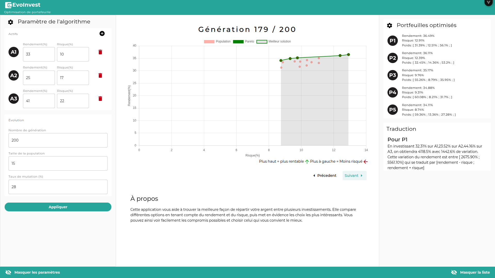

# EvoInvest

> Cette application vous aide à trouver la meilleure façon de répartir votre argent entre plusieurs investissements. Elle compare différentes options en tenant compte du rendement et du risque, puis met en évidence les choix les plus intéressants. Vous pouvez ainsi voir facilement les compromis possibles et choisir celui qui vous convient le mieux.


---

## 📸 Aperçu



---

## 🧱 Stack technique

| Couche   | Technologie            |
| -------- | ---------------------- |
| Frontend | Vue 3 (Quasar)         |
| DevOps   | Docker, Docker Compose |

---

## 📁 Structure du projet

```
evoinvest/
│
│── src/
│── Dockerfile
└── README.md
```

---

## 🚀 Installation & Lancement

### Prérequis

- Git
- Node.js 20+ ou [Docker](https://www.docker.com/)

### 1. Cloner le projet

```bash
git clone https://github.com/Delon-HUB/shop2mada.git
cd evoinvest
```

### 2. Lancer avec Docker

```bash
docker image build -t evoinvest
docker run -d --name evoinvest -p 8080:80 evoinvest:latest
```

---

### 3. Accéder à l'application

http://localhost:8080

---

### 4. Arrêter l'application

```bash
docker stop evoinvest
```

## 🛠️ Développement local (sans Docker)

```bash
# Backend
cd evoinvest
npm install
npm run dev
```

---

## 👤 Auteur

**Nicolas Delon**

- GitHub : [@Delon-HUB](https://github.com/Delon-HUB)

---
